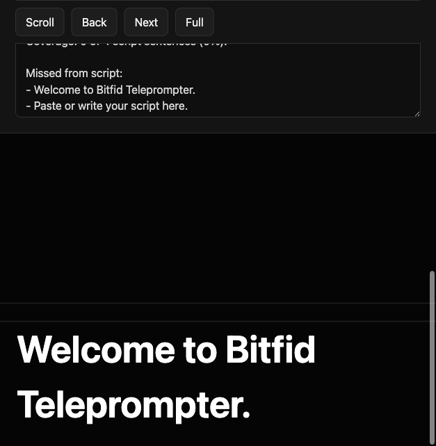
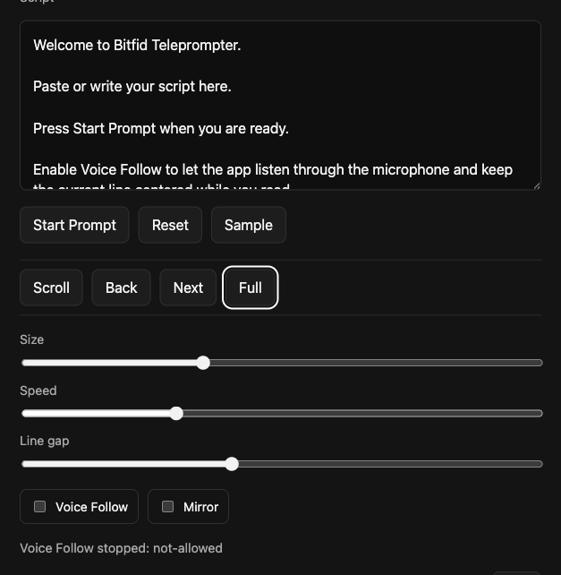
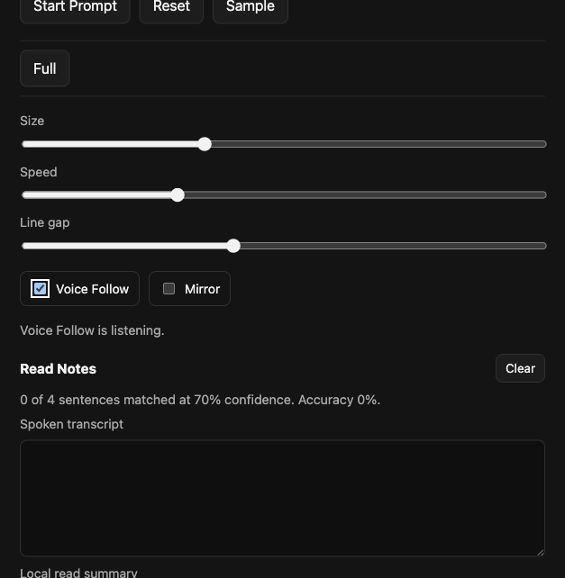

# Bitfid Teleprompter App

A lightweight local test version of a teleprompter for Mac and iPhone. It runs from a small Python server and opens in a browser, so the same test build can be used on a laptop or an iPhone on the same Wi-Fi network.

This version uses the built-in microphone through browser speech recognition for Voice Follow. A speaker outputs sound; the microphone is the practical input for estimating which line the user is reading.



## Features

- Paste or write a script and turn it into a teleprompter.
- Minimal black, gray, and white interface.
- Manual auto-scroll with speed, text size, and line gap controls.
- Voice Follow mode using the built-in microphone and browser speech recognition where supported.
- Forward-only Voice Follow, so missed lines are noted instead of pulling the prompt backward.
- Read Notes with spoken transcript, missed script sentences, added spoken content, coverage, and estimated accuracy.
- Mirror mode for physical teleprompter glass.
- Fullscreen prompt view with keyboard pause support.

## Requirements

- Python 3.10 or newer.
- Safari or Chrome for microphone-based Voice Follow.
- iPhone and Mac on the same Wi-Fi network for phone testing.

No Python packages are required for this test version.

## Quick Start

```bash
python3 -m bitfid_teleprompter.server
```

The terminal prints two URLs:

- `Mac`: open this on the computer running the server.
- `iPhone`: open this on an iPhone connected to the same Wi-Fi network.

Example:

```text
Mac:    http://127.0.0.1:8765
iPhone: http://192.168.1.221:8765
```

## Manual Teleprompter Mode

1. Paste or write your script in the `Script` box.
2. Click `Start Prompt`.
3. Adjust `Size`, `Speed`, and `Line gap`.
4. Click `Scroll` to start auto-scrolling.
5. Click `Pause`, or press the `Space` key, to pause.
6. Use `Back` and `Next` to move one script sentence at a time.
7. Click `Full` to enter fullscreen prompt mode.

The `PAUSED` watermark appears only in fullscreen mode when manual scrolling is paused.



## Voice Follow Mode

1. Paste or write your script.
2. Click `Start Prompt`.
3. Enable `Voice Follow`.
4. Allow microphone access if the browser asks.
5. Read naturally.

In Voice Follow mode:

- The app listens through the built-in microphone.
- The prompt moves forward only.
- It does not scroll backward for missed lines.
- `Scroll`, `Back`, and `Next` are hidden.
- `Full` remains available.
- Press `Space` to pause or resume Voice Follow.
- The pause watermark stays hidden in Voice Follow mode.



## Read Notes

The left panel includes `Read Notes` for reviewing the read-through:

- `Spoken transcript`: everything the browser speech recognizer finalizes.
- `Local read summary`: estimated accuracy, coverage, missed script sentences, and added spoken content.
- `Clear`: resets the transcript and local summary.

Sentence matching is intentionally approximate. A script sentence is marked as read when the spoken words match at about `70%` confidence.

## iPhone Testing

1. Start the server on your Mac.
2. Make sure the iPhone is on the same Wi-Fi network.
3. Open the printed iPhone URL in Safari or Chrome.
4. Use `Full` for a cleaner teleprompter screen.
5. For Voice Follow, allow microphone access when prompted.

## Test the Code

```bash
python3 -m unittest
```

## Voice Follow Design

Browsers do not let a web app use the laptop speaker as an input sensor. Voice Follow uses the built-in microphone to estimate which line the user is reading and keeps that line centered. This is the open-source, lightweight path that works across normal laptops and phones without native app-store packaging.

Microphone support depends on the browser. Safari and Chrome are the best targets for this test version.
